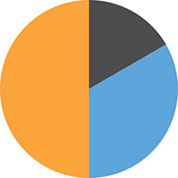

create-svg-pie
==============
[](https://travis-ci.org/janjarfalk/create-svg-pie)

Create a SVG pie chart from number array.

## Installation
```sh
npm install create-svg-pie --save
```

## Usage
```js
import createSVGPie from 'create-svg-pie';

const values = [5, 10, 15];
const radius = 100;

const pie = createSVGPie(values, pie);

document.body.appendChild(pie);
```
## Example Result (html)
```html
<svg width="200" height="200" viewBox="0 0 200 200">
  <path d="M100,100  L100,0  A100,100 0 0,1 186.60254037844388,50.00000000000001 z" fill="#4D4D4D"></path>
  <path d="M100,100  L186.60254037844388,50.00000000000001  A100,100 0 0,1 100,200 z" fill="#5DA5DA"></path>
  <path d="M100,100  L100,200  A100,100 0 0,1 99.99999999999999,0 z" fill="#FAA43A"></path>
</svg>
```

## Example Result (image)



## Contributing

In lieu of a formal styleguide, take care to maintain the existing coding style.
Add unit tests for any new or changed functionality. Lint and test your code.

## Release History

* 1.0.0 Initial release

## Todo
- Create useful tests
